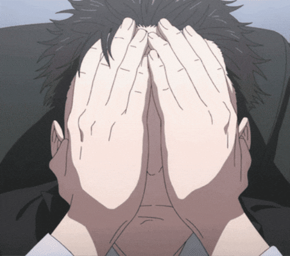

  

  

- 🔭 I’m currently working on **2D Platformer**

- 🌱 I’m currently learning **Unity and C#**

- 📫 How to reach me **kapriankit1@gmail.com**

<h3 align="center">Languages and Tools:</h3>

      

    

<picture>
  <source media="(prefers-color-scheme: dark)" srcset="https://raw.githubusercontent.com/Akushaj/Akushaj/output/github-snake-dark.svg" />
  <source media="(prefers-color-scheme: light)" srcset="https://raw.githubusercontent.com/Akushaj/Akushaj/output/github-snake.svg" />
  
</picture>
